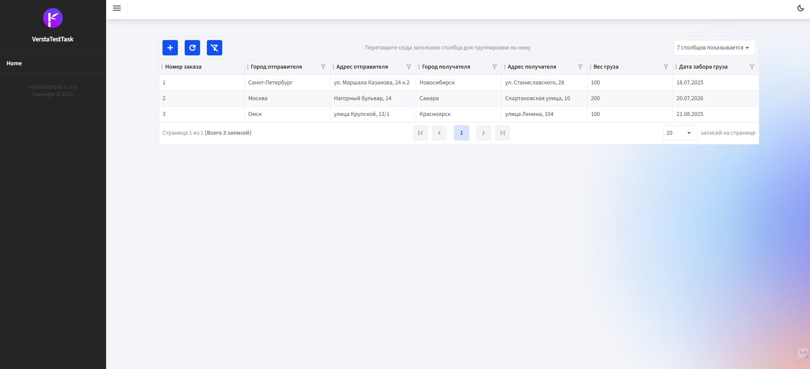
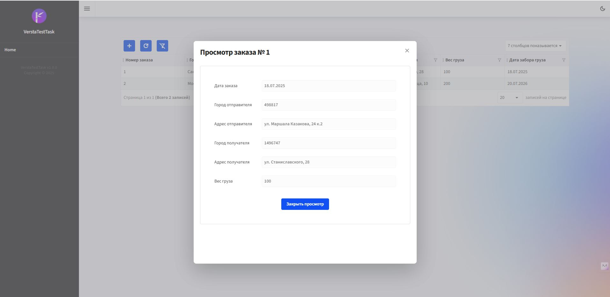
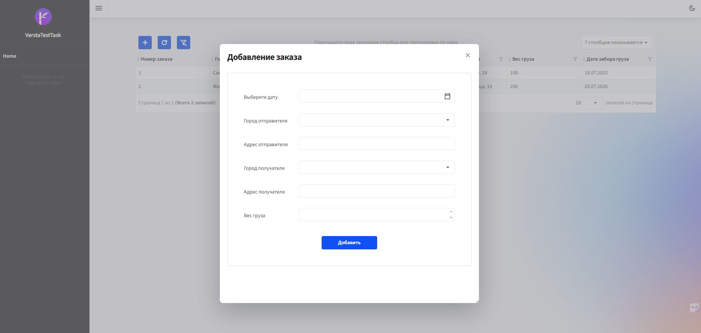
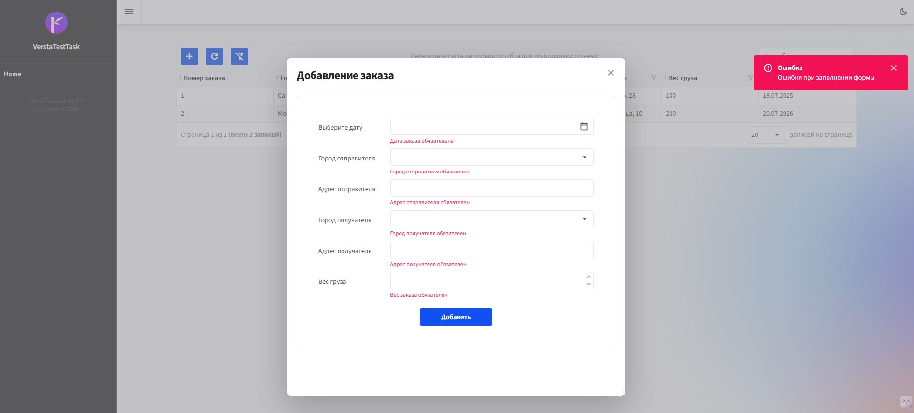
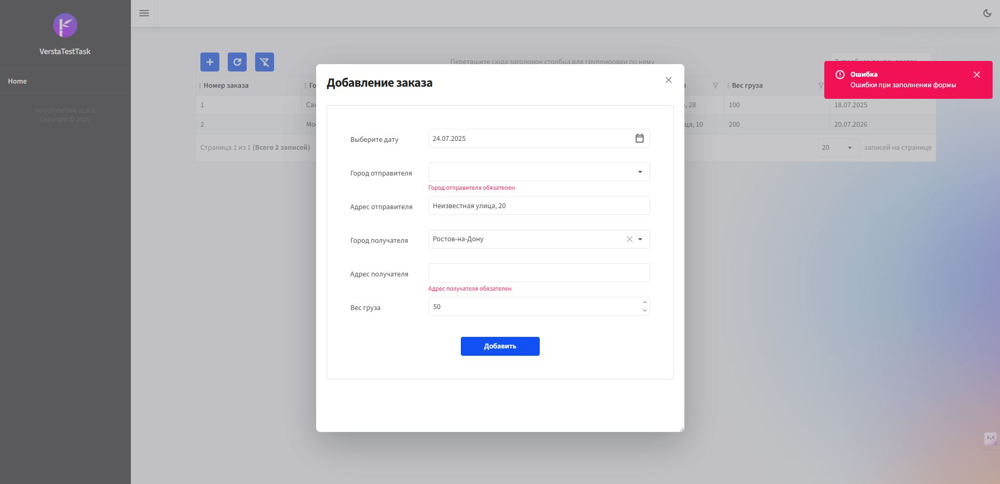
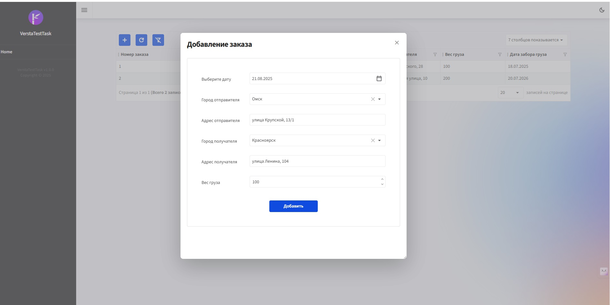
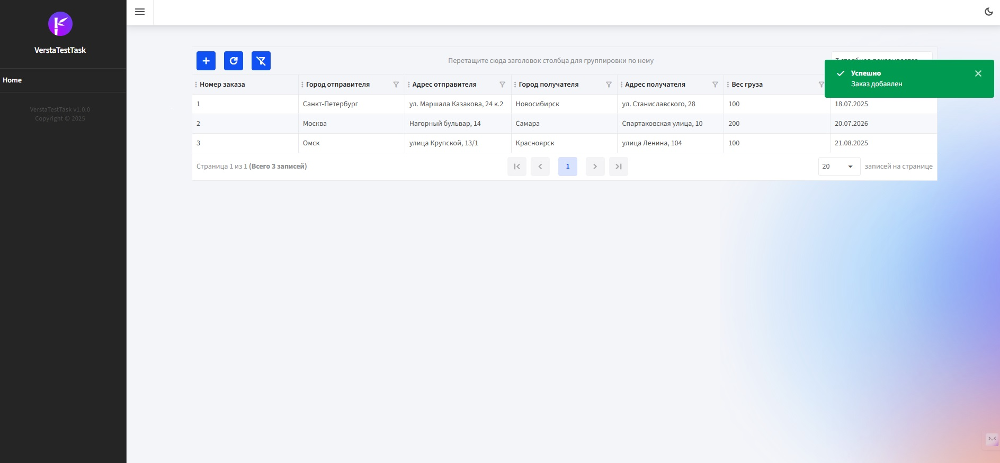
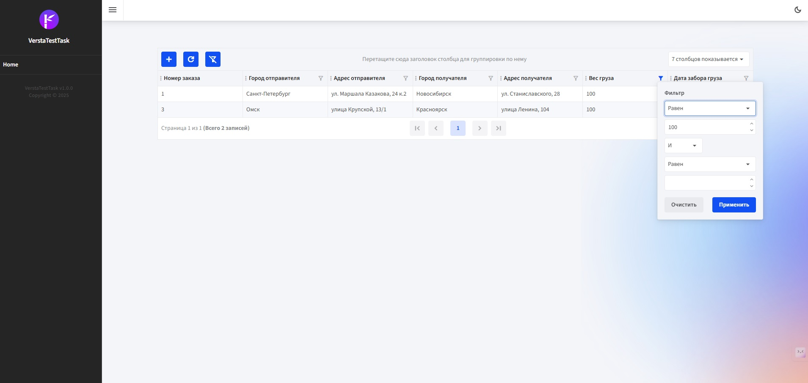

# VerstaTestTask

## Как собрать и запустить приложение:

1. Клонировать репозиторий

```git clone https://github.com/sergeyfedorov02/VerstaTestTask.git```

2. Перейти в рабочий каталог

```cd VerstaTestTask```

3. Сделать публикацию для работы web-сервера

```dotnet publish -p:PublishProfile=FolderProfile```

4. Перейти в каталог с исполняемым файлом и запустить его

```
cd bin\Release\net9.0\publish
VerstaTestTask.exe
```

Приложение будет запущено по адресу *http://localhost:5000/*

## Информация о проекте:
1. Для формирования нчального проекта использовался Radzen Blazor Studio

*https://www.radzen.com/blazor-studio/*

2. Приложение является blazor-приложением и использует библиотеку Controls от Radzen
3. Для доступа к базе данных используется Entity Framework и провайдер SQLite. 
4. При запуске приложения создатся файл базы данных в каталоге *wwwroot*
5. Для получения списка городов на русском языке использовался сервис oxilor. Список городов России (первые 100) на русском языке можно получить, используя вызов

*https://data-api.oxilor.com/rest/regions?type=city&countryCode=RU&first=100*

6. В базу для примера внесено 10 городов (добавление осуществляется в файле миграции)

## Возникшие сложности:
1. SQLite плохо работает с поиском на русском языке. Поэтому фильтрация на русском языке по текстовым полям в таблице заказов не работает (при использовании PostgreSQL все работает корректно)

## Демонстрация работы

Основная страница с отображением списка всех заказов



Просмотр заказа



Форма добавления заказа



Добавление заказа с ошибкой



все поля являются обязательным для заполнения


Успешное добавление заказа





Пример группировки и фильтрации




